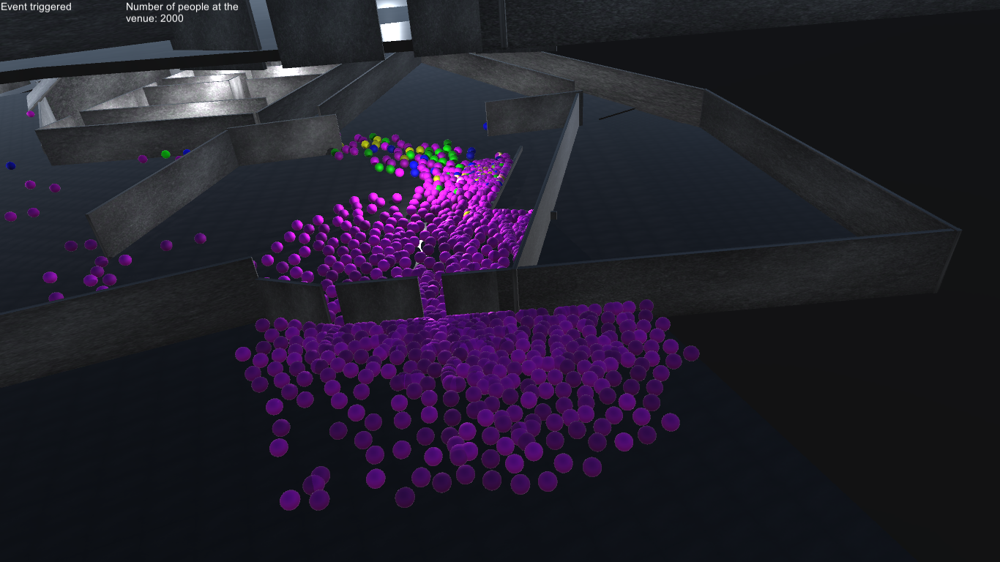
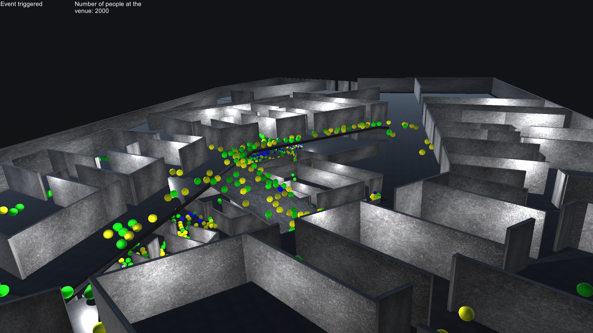
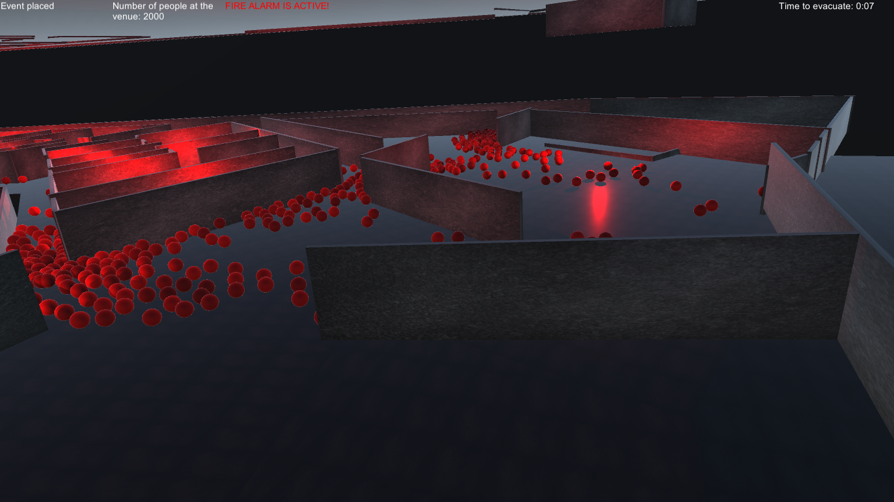
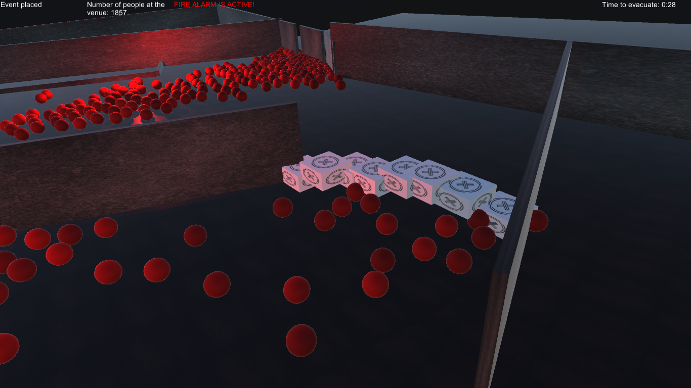
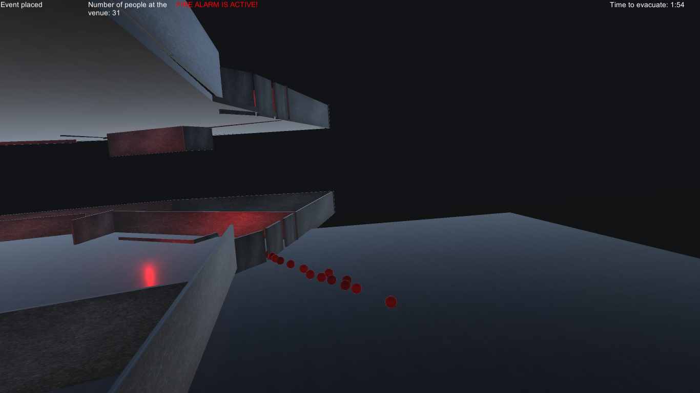

# CrowdsAgainstHumanity

Crowds Against Humanity is a venue planner solution made in Unity that is capable of simulating massive crowd flows at an event venue. It supports realtime communal events and emergency evacuations, as well as the placement and removal of obstructions to affect the flow of people.

## Details

People are simulated using Unity's Navigation system, extended to easily support a large number of actors with no noticeable performance drop on even middle-end hardware. Actors are colour-coded according to their current job. People just arriving to the venue are grey, those attending communal events are purple, going to the toilet or the snack bar is represented by yellow and blue, while people evacuating are rendered in red. 

Another feature of note is the impetus of crowds. Crowds Against Humanity simulates people's indecision and crowd flow pressure to deliver accurate crowd simulations.

## Example Pictures

### People checking in

### People going about their bussines

### Fire alarm activated

### The way is blocked by obstacles placed in real time

### The last of the participants are escaping

